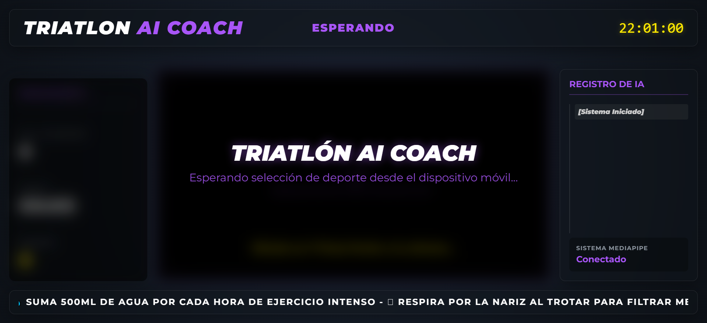
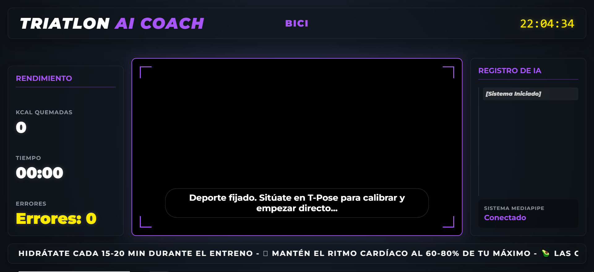
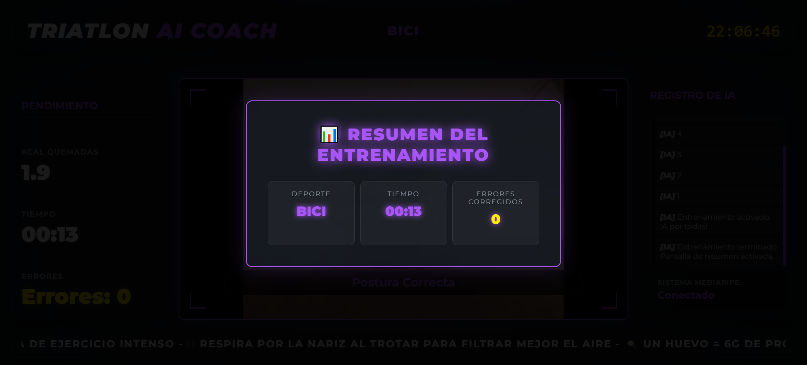

# 🏊‍♂️ Triathlon Training Assistant
[Node.js] [JavaScript] [Socket.IO] [MIT]

A real-time web application that helps triathlon athletes improve their training experience through live communication, interactive interfaces and real-time feedback.

This project was developed as part of a university team project at Universidad Carlos III de Madrid.

---

## 📖 Overview

Triathlon Training Assistant is a real-time web application designed to support triathlon athletes during indoor training sessions.

The system connects a smartphone and a desktop application through Socket.IO. The smartphone captures the athlete using its camera, while the desktop application performs real-time posture analysis using MediaPipe Pose and provides immediate feedback.

Users can interact with the system through voice commands, receive posture corrections, monitor live training statistics and access additional tools such as a nearby sports facilities map.

This project was developed as part of a university team project at Universidad Carlos III de Madrid.

---

## 📸 Screenshots

Below are some screenshots of the desktop application during different stages of a training session.

### Home Screen

<p align="center">
  
</p>

### Training Session

<p align="center">
  
</p>

### Training Summary

<p align="center">
  
</p>

---

## 🚀 Features

- Real-time posture analysis using MediaPipe Pose.
- Live communication between desktop and mobile devices using Socket.IO.
- Voice commands and speech feedback using the Web Speech API.
- Multiple training modes for running, cycling and swimming.
- Interactive dashboard with live training statistics.
- Nearby sports facilities map powered by Leaflet and OpenStreetMap.
- Responsive user interface for desktop and mobile devices.

---

## 🏗️ Architecture

```
 Smartphone
 (Camera + Voice Commands)
            │
            ▼
 Node.js + Socket.IO Server
            │
            ▼
 Desktop Application
            │
 ├── MediaPipe Pose Analysis
 ├── Training Dashboard
 ├── Voice Feedback
 └── Session Monitoring
```

The system uses a distributed client-server architecture that enables real-time communication between the mobile device and the desktop application.

## 💻 Technologies

| Category | Technologies |
|----------|--------------|
| Backend | Node.js, Express |
| Communication | Socket.IO |
| Frontend | HTML5, CSS3, JavaScript |
| Computer Vision | MediaPipe Pose |
| Voice | Web Speech API |
| Maps | Leaflet, OpenStreetMap |

---

## ⚙️ Installation

Clone the repository:

```bash
git clone https://github.com/sergio-villafuertes/triathlon-training-assistant.git
```

Install the dependencies:

```bash
npm install
```

Start the application:

```bash
npm run tunnel
```

Once the server is running, open your browser and access the application through the generated local address.

> **Note**
>
> The application requires Node.js and a modern Chromium-based browser with camera and microphone permissions enabled.

---

## 👨‍💻 My Contributions

As part of the development team, I contributed to:

- Development of client-side functionality in `app.js`.
- Design and implementation of user interface components using HTML and CSS.
- Front-end integration and usability improvements.
- Testing and debugging during the implementation process.

---

## 📁 Project Structure

```
triathlon-training-assistant
│
├── public/
│   ├── app.js
│   ├── index.html
│   ├── pinganillo.html
│   ├── pinganillo.css
│   └── style.css
│
├── server.js
├── runner.js
├── package.json
├── README.md
└── .gitignore
```

---

## 🎯 Project Goals

The objective of this project was to design an interactive training assistant capable of helping athletes improve their posture during indoor triathlon sessions through real-time computer vision and voice interaction.

---

## 🔮 Future Improvements

- Adaptive posture profiles.
- Session history.
- User authentication.
- Performance analytics.
- Improved posture detection.
- Cloud deployment.

---

## 📄 License

This project is distributed under the MIT License.